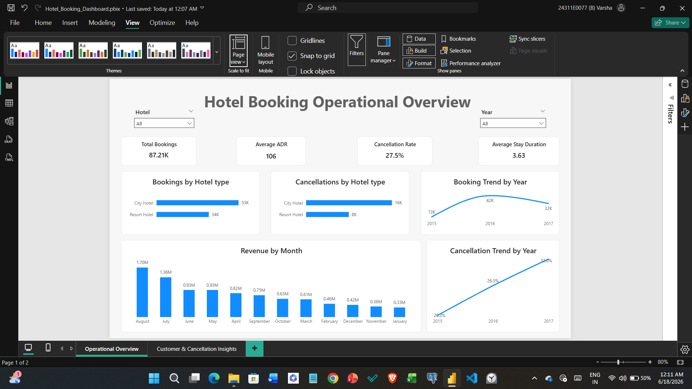
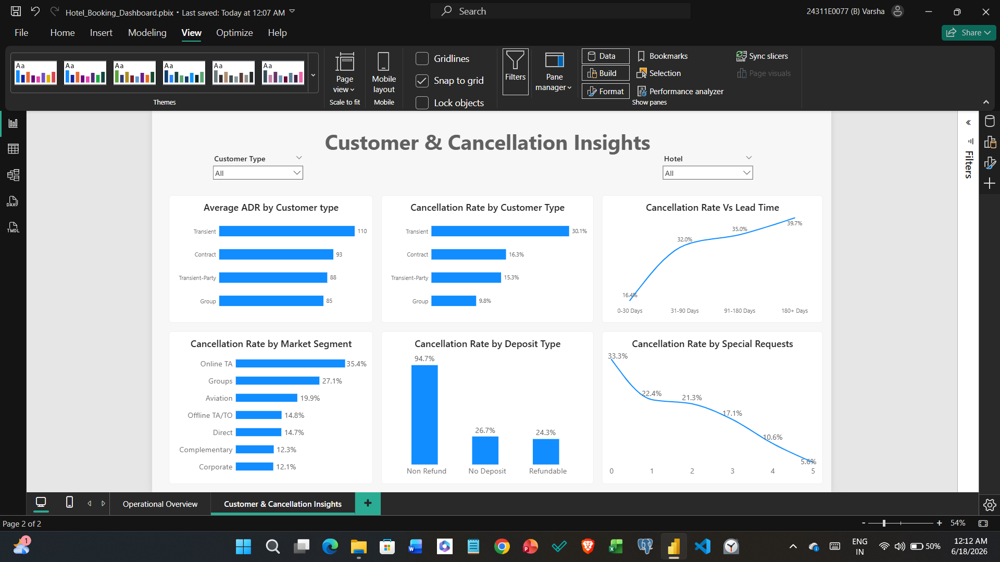

# Hotel Booking Demand Analysis

# Project Overview:

This is an end-to-end data analytics project based on the Hotel Booking Demand dataset. In this project, I cleaned the data using Python, analyzed the data using SQL, and created an interactive dashboard in Power BI to understand booking trends, customer behavior, revenue patterns, and cancellation factors.

# Tools used for the Analysis:
- Excel
- Python (Pandas, NumPy)
- PostgreSQL
- Power BI

# Dashboard Overview:

## Page 1: Operational Overview

This page provides a high-level overview of hotel performance through:
- Total Bookings
- Average ADR (Average Daily Rate)
- Cancellation Rate
- Average Stay Duration
- Bookings by Hotel Type
- Cancellations by Hotel Type
- Revenue by Month
- Booking Trend by Year
- Cancellation Trend by Year

## Page 2: Customer & Cancellation Insights

This page focuses on customer behavior and cancellation analysis through:
- ADR by Customer Type
- Cancellation Rate by Customer Type
- Cancellation Rate by Market Segment
- Cancellation Rate by Deposit Type
- Lead Time vs Cancellation Rate
- Special Requests vs Cancellation Rate.

# Key Insights:

1. City Hotels received more bookings compared to Resort Hotels.
2. Cancellation rates increased over the years.
3. Customers with longer lead times were more likely to cancel their bookings.
4. Customers with more special requests showed lower cancellation rates.
5. Non-Refund deposit bookings had the highest cancellation rate.

# Project Workflow:

1. Data Cleaning using Python (Pandas)
2. Exploratory Data Analysis (EDA)
3. SQL Analysis to answer business questions
4. Power BI Dashboard Development
5. Business Insights & Recommendations

### Operational Overview

### Customer & Cancellation Insights

